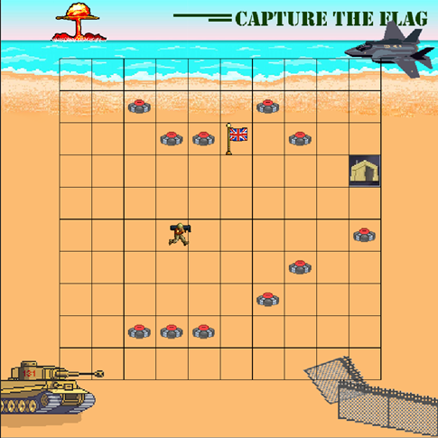

# C Capture The Flag Bot

This program renders a game in which a soldier (the robot) randomly explores a grid in order to find a 
flag while getting around landmines (the obstacles). Once the soldier captures the flag, it brings it 
back to his spawn point by reversing all of his previous moves.
This program has been written in the context of the UCL COMP0002 C project coursework.

[](https://github.com/Allenbrd/C-Capture-The-Flag-Robot/blob/master/illustrations/pic1.png)
[](https://github.com/Allenbrd/C-Capture-The-Flag-Robot/blob/master/illustrations/pic1.png)

## How to run this code
In order to start the program, compile and then run via the following commands:
```
> gcc -o controller controller.c model.c view.c settings.c graphics/graphics.c
> ./controller | java -jar graphics/drawapp-3.0.jar
```

## Code structure and directories
This code was designed using a model-view-controller design pattern. In the latter, the controller.c file 
contains the main game logic and controls the model code. The model.c file contains all necessary 
functions and data structures and updates the view. The view.c file’s code is used to display the game 
to the user while updating the interface according to the model’s commands.

[](https://github.com/Allenbrd/C-Capture-The-Flag-Robot/blob/master/illustrations/files-structure.png)

This project is thus composed of three .c files, along with their .h header files, and two subdirectories: 
./graphics, which must contain all necessary files for graphics rendering, and ./assets, which contains 
all images displayed in the user interface.
